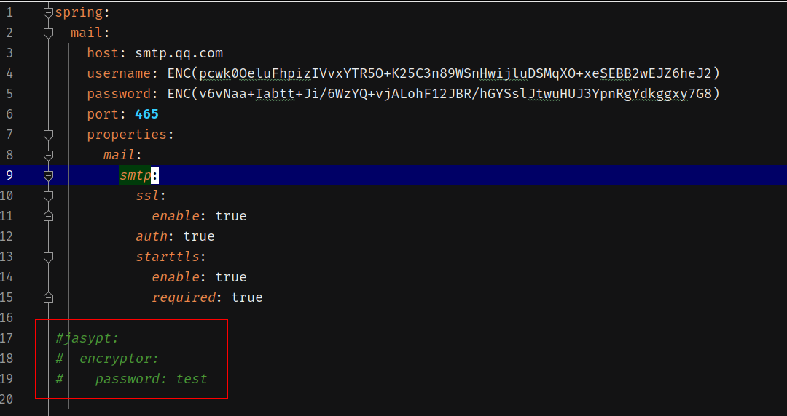
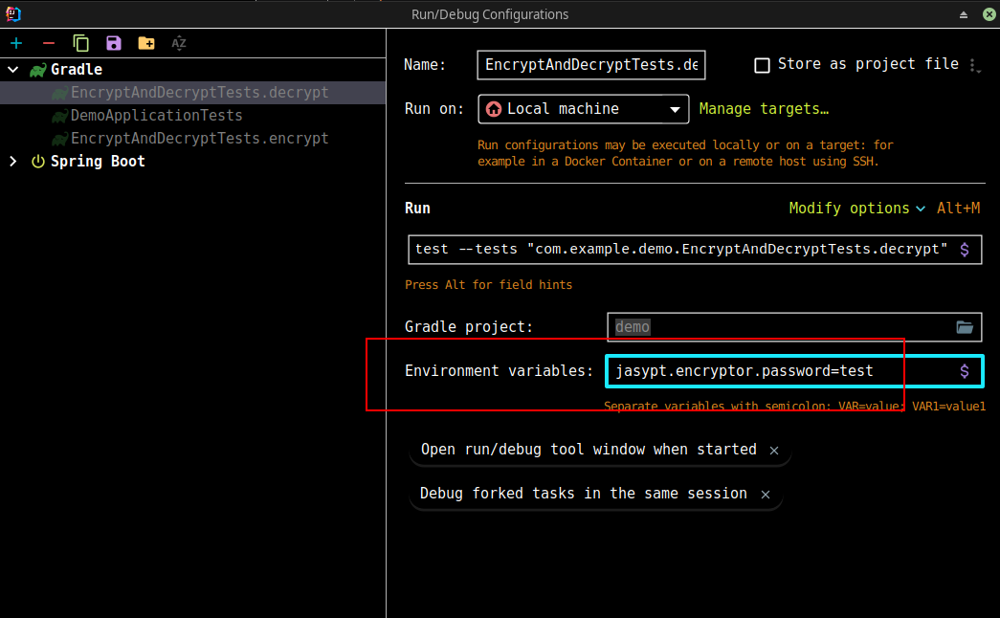

# 内容

邮箱服务集成。

其中配置文件为加密过的用户名以及密码（QQ邮箱叫授权码）。

- 如果不需要加密，去掉加密依赖，同时配置文件中直接写明文的用户名以及密码
- 如果需要加密，请先配置加密口令

# 加密口令配置方式

支持方式如下：

- 直接在配置文件中配置
- 在运行配置中以环境变量的方式配置

# 环境

- spring-boot-starter-mail
- jasypt-spring-boot-starter

# 博客

[地址](https://blog.csdn.net/qq_27525611/article/details/108668153)
